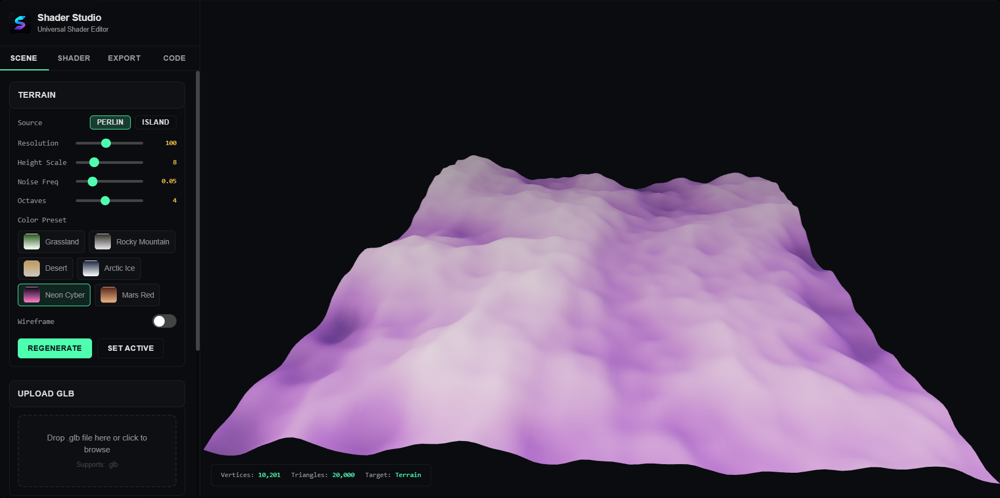

# ⚡ Universal Shader Studio

<div align="center">

**A real-time GLSL shader editor built with React + Three.js**  
Write shaders. See them live. Export anywhere.

[](https://shader-studio-teal.vercel.app)
[](https://react.dev)
[](https://threejs.org)
[](https://vite.dev)



</div>

---

## What Is This?

Universal Shader Studio is a browser-based tool for writing and previewing custom GLSL shaders in real time — no setup, no install, no backend. Drop in a GLB, choose a primitive, or generate procedural terrain, then write your shader and hit **Compile**. Export the result as Three.js `ShaderMaterial`, R3F component, or raw GLSL.

Built for 3D devs who want a fast creative sandbox without leaving the browser.

---

## Features

| Feature | Description |
|---|---|
| 🏔️ **Procedural Terrain** | Perlin & Island noise with adjustable resolution, height, octaves |
| 🔷 **Primitives** | Cube, Sphere, Torus, Cylinder — swap instantly |
| 📦 **GLB Upload** | Drag & drop any GLB model — auto-centered, auto-scaled |
| ⚡ **Live GLSL Editor** | Write vertex + fragment shaders with syntax highlighting |
| 🎨 **Shader Presets** | Built-in presets to start from — edit and go |
| 📤 **Multi-format Export** | Three.js ShaderMaterial · R3F Component · Raw GLSL · Vanilla WebGL |
| 🌈 **Color Presets** | Terrain color themes — Grassland, Rocky Mountain, Desert, Neon Cyber, Mars Red |

---

## How to Use

### Terrain
Adjust sliders (Resolution, Height Scale, Noise Freq, Octaves) and pick a Color Preset.  
→ Click **Regenerate** to apply.

### Primitives
Select a shape from the Primitives section.  
→ Click **Set Active** to load it into the scene.

### GLB Upload
Activate a Terrain or Primitive first, then drag your `.glb` file into the drop zone.  
Your model replaces the current scene object, auto-centered and scaled.

### Shader Editor ⚠️
This is the core. Write GLSL in the Shader tab — vertex and fragment both.  
→ **You must click Compile every time you change the shader.** Nothing updates automatically.

### Export
Go to the Export tab → choose your format → Copy or Download.

---

## Tech Stack

```
React 18          — UI framework
Three.js r168     — 3D rendering
Vite 7            — Build tool
Tailwind CSS v3   — Styling
shadcn/ui         — UI components
GLTFLoader        — GLB model loading
BufferGeometryUtils — Geometry merging
Perlin noise      — Procedural terrain generation
```

---

## Local Development

```bash
# Clone
git clone https://github.com/void032/shader-studio.git
cd shader-studio

# Install
npm install

# Dev server
npm run dev

# Production build
npm run build
```

> Requires Node.js 20+

---

## Project Structure

```
src/
├── components/
│   ├── scene/          # GLBControls, PrimitiveControls, TerrainControls
│   ├── tabs/           # SceneTab, ShaderTab, ExportTab, CodeTab
│   └── ui/             # shadcn components + custom FileDropZone, CodeBlock, etc.
├── context/
│   └── StudioContext   # Global app state
├── hooks/
│   ├── useThreeScene   # Three.js scene setup
│   ├── useGLBLoader    # GLB loading + geometry processing
│   ├── useShaderCompiler # GLSL compilation
│   ├── useTerrain      # Procedural terrain generation
│   └── usePerlin       # Perlin noise implementation
└── lib/
    ├── shaderPresets   # Built-in GLSL presets
    ├── codeTemplates   # Export format templates
    ├── colorPresets    # Terrain color schemes
    └── exporters       # Multi-format export logic
```

---

## GLSL Uniforms Available

These uniforms are automatically injected and available in your shaders:

```glsl
uniform float u_time;        // elapsed time in seconds
uniform vec2  u_resolution;  // canvas width + height
uniform vec3  u_color;       // base color from UI
uniform float u_intensity;   // intensity slider value
```

---

## Export Formats

**Three.js ShaderMaterial**
```js
const material = new THREE.ShaderMaterial({
  uniforms: { u_time: { value: 0 } },
  vertexShader: `...`,
  fragmentShader: `...`,
});
```

**R3F Component**
```jsx
<shaderMaterial
  vertexShader={vertexShader}
  fragmentShader={fragmentShader}
  uniforms={uniforms}
/>
```

**Raw GLSL** — copy vertex and fragment shader separately.

**Vanilla WebGL** — full boilerplate with program creation and uniform location setup.

---

## Deploying

This is a pure static frontend — deploy anywhere:

```bash
npm run build   # outputs to /dist
```

Works on Vercel, Netlify, GitHub Pages, Cloudflare Pages.

---

## License

MIT — do whatever you want with it.

---

<div align="center">

Built by **[Void](https://github.com/void032)**

</div>
